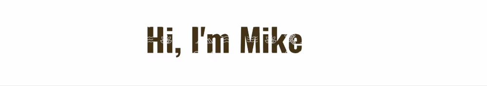

<!--## Hello, I'm Mike   -->
👋 I've been busy teaching myself to be a web developer. It's starting to get really fun! 

- 🔭 I’m currently working on making my sites more mobile responsive
- 🌱 I’m currently learning advanced Javascript
- 👯 I’m looking to collaborate on something fun and worthwhile
- 🤔 I’m looking for help with getting a dev job
- 💬 Ask me about learning to code ... or ultralight hiking gear, or woodworking
- ⚡ Fun fact: I once saw Oasis perform in the back room of a pub

#### Check out my [Learning Tracker][tracker] or head over to [mikeback.me][website] to see my portfolio or to get in touch

[tracker]: https://github.com/MakeItBack/Learning-Tracker
[website]: https://www.mikeback.me
